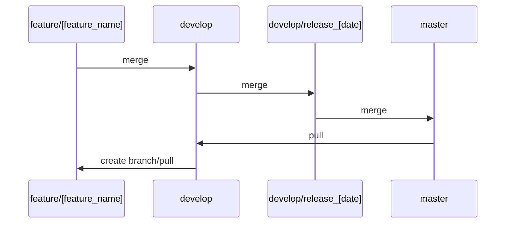

# MEC_tools
Some useful tool for my worklife in MEC portal team.\
click to access >> https://johnchow-tech.github.io/MEC_tools/index.html

---

##### Dependencies must be installed on a per-environment basis.
>1. git clone [this project]
>2. cd MEC_TOOLS
>3. npm install
>4. npm start

---

## Git Policy

