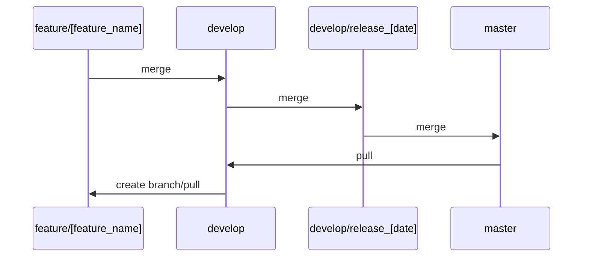

# MEC_tools
Some useful tool for my worklife in MEC portal team.

---

## git policy

```mermaid
sequenceDiagram
    feature/[feature_name] ->> develop: merge
    develop ->> develop/release_[date]: merge
    develop/release_[date] ->> master: merge
    master ->> develop: pull
    develop ->> feature/[feature_name]: create branch/pull
```